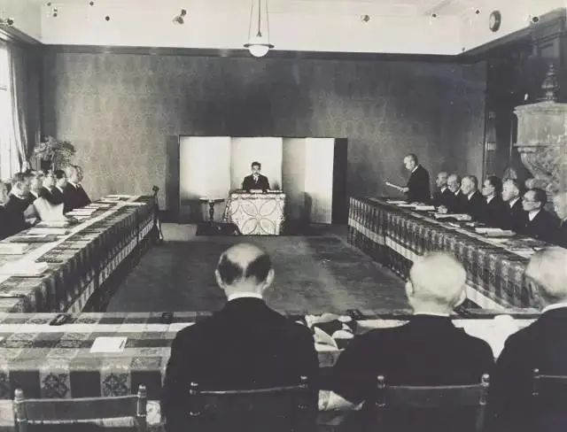
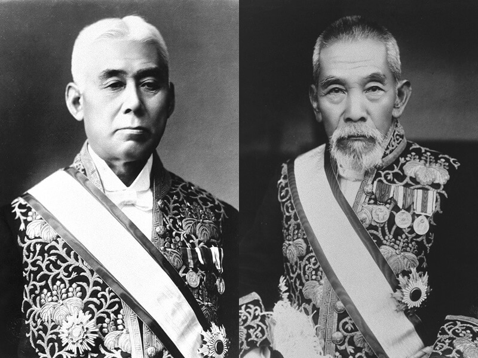
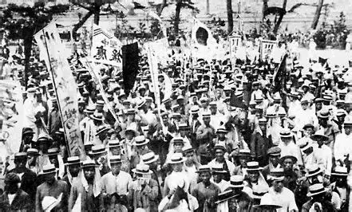

# DR-WIKI
 >大日本帝国 （游戏开局） 
 
 ## 天皇：嘉仁天皇  
 
 ## 内阁首相：  
 ## 日本近代政治转型的危机与重构（1905-1919）：从日俄战争到大正民主

马礼逊号事件并未掀起太大风浪，1842年，随着中国于鸦片战争战败，促使幕府逐渐开始放弃驱除外国船。佩里收到了海军部长肯尼迪于1852年11月13日的指示。其主要职责包括在执行对日本的使命时行使广泛的自由裁量权，探索日本海岸和邻近的大陆和岛屿，并收集有关其访问的国家和地区的社会、政治和商业状况的一切可能的信息，特别是有关新的商业对象的信息。佩里舰队于下午5点出现在浦贺海岸附近。 1853年7月8日启航并停泊。日本人第一次见到的舰船和此前参观过的俄国和英国海军的帆船有所不同。这艘黑色船身的明轮船除了船帆之外，还靠明轮和蒸汽机提供动力，拖曳着每艘帆船前行，烟囱里冒出滚滚浓烟。因此，日本人把它们称为 “黑船”。

停泊在浦贺海岸的舰队由四艘舰船组成：旗舰萨斯奎哈纳号（蒸汽明轮护卫舰）、密西西比号（蒸汽明轮护卫舰）、萨拉托加号（单桅帆船）和普利茅斯号（蒸汽明轮护卫舰）。部队共有73门大炮，严阵以待，担心日军的进攻。

浦贺奉行者户田氏吉首先派遣浦贺奉行处的寄力中岛三郎介前往美国舰队旗舰萨斯奎哈纳号，得知佩里此行的目的是将美国总统的亲笔信交给幕府将军。为了登上萨斯奎哈纳号，中岛伪称自己是“副知事”，但佩里一方拒绝接受这封信，声称他的级别对于幕府来说太低了。第二天，即7月9日，浦贺奉行署的寄力加山英左卫门以浦贺奉行署的名义来到该岛，与大佐布坎南、参谋长亚当斯、佩里的副官孔蒂会面。然而，答复仍旧没有改变，这封信被拒绝了，信息只发给了最高级别的官员。加山请求四天时间与上级磋商，但佩里回答说他要等三天，并进一步威胁说，如果他不派高级官员来接收这封信，他将北上穿过江户湾，带着他的军队登陆，亲自把信交给幕府将军。

同日，佩里从舰队中各派出一艘武装小艇，侦察浦贺港内部。这次调查对幕府产生了震慑作用。当然，浦贺县令提出了抗议。其答案是以消除闭关锁国体制下存在的不平等国际关系为出发点，其中包括把不平等国际关系强加给日本的思想。7月11日清晨出发，测量船队在美国战列舰密西西比号的护航下，深入江户湾约20公里。这一行动背后，是佩里的希望，“以强大的战舰接近江户，将唤醒日本政府（幕府），并做出对美国更为有利的回应”。幕府对此大为震惊，于7月12日接受了这封信，并表示“将此信暂且搁置，任其自行处理，速去处理眼前事务”，并指示浦贺奉行伊户弘道通过长崎荷属商号的首领传达复函，由其处理此事。

此时，第十二代将军德川家吉卧床不起，无法做出事关国家大事的决策。7月11日，首席参议阿部昌弘作出“只好接受函件”的结论，并于7月14日允许佩里一行在久里滨登陆。在下曾根信笃率领的幕府直属军，以及陆地上的川越藩、彦根藩和海上的会津藩、押解藩的镇压下，浦贺藩的奉行者户田氏吉、井户弘道与佩里会面。

佩里向他们递交了菲尔莫尔总统的亲笔信，敦促他们开放国家，以及海军上将的国书和备忘录。然而，幕府要求一年的时间来答复，称将军生病了，无法做出决定。佩里回应说他将在一年后回来听取他们的答复。这里只是交换文件，并没有进行外交谈判。日本两位全权代表——浦贺县令户田、井户，均没有发表任何言论。

日方原以为佩里会在会谈结束后两三天离开，但7月15日，佩里登上美国军舰密西西比号，从浦贺向北航行20英里，到达可以清楚看见江户港的地方，在向将军展示出足够的威胁后，便返回了小芝海岸。舰队于7月17日从江户出发，与留在琉球的舰队会合，返回英国殖民地香港。

 ### 幕府倒台与戊辰战争（1837-1867）
 江户时代末期，围绕开国与通商条约的问题，国家与世界陷入分裂，黑船事件的爆发让幕府彻底丢了脸面。1858年，当时《保佑秘敕令》不经过幕府而直接颁赐给水户藩。最终，幕府面临着朝廷要求幕府改革政体、实施驱逐外国人的政策的局面。幕府于是开始要求朝廷重新确认并制度化将权力委托给幕府，作为朝廷与幕府统一的一部分。其最终目的是通过将其命令变为幕府或天皇的命令来重新加强幕府的权力并统一国家。

 萨摩藩曾设想朝野合一，各大藩国参与政治，但山阳会议破裂后，萨摩藩与将军监护人德川庆喜以及幕府政权产生了矛盾。萨摩藩视为王牌的“四大藩会议” 因已成为第十五代将军的义喜的政治权力而失效。结果，萨摩藩放弃了以义喜为首的诸侯会议的想法，和长州藩一起倾向于使用武力推翻幕府。随后，天皇在京都御所内学问所发布了“王政复古大号令”。当天，在京都御所内的小御所进行了第一次总裁、议定、参与三职会议，称为小御所会议，要求德川庆喜辞去内大臣官职并削封德川家领地。

 诸藩并不完全认同萨摩等藩的强硬主张，而幕府方面的强硬派坚决反对辞官纳地。12月16日，德川庆喜在大阪与美国、大英帝国、法兰西帝国、荷兰王国、奥地利帝国、普鲁士王国六国公使会谈，要求不干涉日本内政并继续承认幕府的外交权。12月19日公然要求朝廷撤回王政复古大号令。

 此事刺激了幕府，更激化了双方的对立。日本西南方武士（以萨摩藩、长州藩为首）组成军事联盟，在天皇的支持下成立帝国政府，尊王攘夷。会津藩、桑名藩的藩兵以谒见天皇为名从大坂向京都进军，同时，以萨摩和长州两藩军队为主力的政府军亦重兵集结，1868年1月27日双方在京都南郊的鸟羽、伏见爆发武装冲突，即鸟羽伏见之战。萨长军获得压倒性军事胜利，倒幕派掌握了新政府的实权，并宣布德川庆喜为朝敌。1868年1月30日，德川庆喜放弃大阪城，由海路逃往江户，失去指挥官的幕府军随即溃散，鸟羽伏见之战结束。

 1月31日，朝廷发布讨伐德川庆喜的命令。2月3日，剥夺了庆喜的官职；9日，由西乡隆盛担任总参谋的东征军以萨摩、长州等藩兵为主力，相继从京都出发。3月12－13日，东征军诸路接近江户，决定3月15日发起总攻。幕府主战派要求决一死战，但幕府重臣胜海舟看到了民心向背的严重形势，与萨长军统帅西乡隆盛谈判成功，劝说德川庆喜投降。4月11日，新政府军和平接收江户，软禁德川庆喜，但德川家得以延续。

 此后内战扩大到东北地方。政府军先后平定了彰义队、奥羽越列藩同盟、虾夷共和国等旧幕府残余势力。8月的会津战役是戊辰战争中的一场关键战役。政府军3000人迂回突袭会津藩的若松城，战斗历经1个多月；9月22日，松平容保率会津藩开城投降。会津藩战死3000人。战后会津藩被迁移到斗南藩（今青森县）。

 12月15日，原幕府海军奉行榎本武扬在北海道成立虾夷共和国政权，与明治政府军交战。之后旧幕府军战败，土方岁三战死。明治二年5月17日，榎本决定五棱郭开城投降，并于5月18日转交给政府军陆军参谋黑田清隆，成立一百多天的虾夷共和国宣告结束。至此，幕末内战“戊辰战争”以德川幕府及其残余势力的失败、新政府军的胜利之下告终。

 ### 明治维新（1968-1877）
 日本明治天皇于1868年4月6日发表的誓文。亲率文武百官在京都御所的正殿紫宸殿向天地、人民宣誓，揭示国是方针，堂堂开启了明治维新的历史序幕。

 维新政府是萨摩、长州、土佐与肥前四藩（一般称为“萨长土肥”）藩士和尊皇派公家等实力者主导，融入大量前幕府（包含幕府解散后改组成的骏府藩）的中阶官僚（通称为幕臣）所形成的政权。名义上政府是以天皇为首，太政大臣宣政的亲政公议政权，但真正的实权则是“萨长土肥”的藩士们掌握，其中萨摩的大久保利通与长州的木户孝允这两位萨长领袖的影响力特别大。但各藩士之间的理念不同，政府的体制也未成熟，因此政府内部经常出现政治冲突，连带影响到政府的组织改革。

 维新政府组织可以明治六年政变做为分水岭。在此之前新政府的组织以镇压叛乱、稳定税收和建制为主，加上公议的主张影响，因此主要实权集中在大藏省和兵部省，政府组织变动激烈。但明治六年政变后，以大久保利通和木户孝允为首的内治派见识到西方工业革命的富强，创立了内务省和工部省，和大藏省构成核心的行政体系，政府组织趋于稳定。政策也转向投入大量工业与交通建设，以及强化国家动员与监控能力。

 明治政府为进一步吸收西方文化，提升在技术、指导、教育、军事制度、整备等领域的水平，而聘用了不少被称为“御雇外国人”的外籍人士，成为日本建设近代国家的一股强大力量。新成立的中央和各县政府聘用了为数众多的外籍人士，包括有采矿、航海、铸币、医学、运输、银行业、法律、政治学、农业、教育、军事等方面的专才。

 西乡隆盛在朝鲜征伐议案中失败后，于1873年（明治6年） 10月辞去议政之职，回到家乡鹿儿岛。桐野敏明、篠原邦元、别府晋介等约600名出生于鹿儿岛的政府官员和军人也随他回国。在西乡的批准下，于1874年6月在鹿儿岛城马厩遗址上创办了一所私立学校。不过，虽然名为学校，但其实是一所由步枪学校和炮兵学校组成的武士军事学院。
 
 明治政府于1871年废藩置县，完成了对全国的直接统治。但是，另一方面，也继承了偿还各藩债务及支付武士俸禄的义务，俸禄的支付占政府财政支出的30％以上。为了恢复当前的财政赤字，政府宣布四个阶级平等，目的是废除不从事生产活动而领取俸禄的特权武士阶级；该州于1873年颁布征兵法，并于1876年废除津贴。这导致了武士阶层的解散，并引发武士叛乱，最终导致了萨摩叛乱。
 
 萨摩叛乱是日本最后一次内战，“士族”这一军事职业的消灭而告终。由义务兵组成的政府军战胜了由武士组成的西乡军，证明了武士与农民出身的士兵在战斗力上没有差别，全民征兵制得以确立。

 政府为萨摩之乱支付的战争费用高达4100万日元，这个巨款几乎用完了当时全部税收4800万日元，占总税收的85.4%。 1877年，明治政府因萨摩叛乱的发生而花费了大量的国家预算，为弥补资金短缺，明治政府不得不发行大量不能兑换的纸币，从而引发了恶性通货膨胀。因此，后来担任大藏大臣的松方正义，作为经济正常化的举措。
 
 1881年（明治32年）实施了废止不可兑换纸币的政策，即后来的“松方通货紧缩政策” 。通过提高税收、出售国营企业、重组货币，他们得以发行可兑换纸币，并通过恢复货币的信誉，为日本成为与欧美列强相媲美的现代化国家奠定了基础。但在这个过程中，“松方通货紧缩”导致佃农数量增加，大地主通过收购这些土地，其比例也随之增加。此外，那些过于贫困而无法继续佃农生活的人纷纷涌向城市，被迫在政府经营的企业出售后设立的财阀经营的工厂里从事低薪劳动，城市贫困人口随之增加。江户时代中期，随着木屐的流行，皮革业和制鞋业取得了经济成功，部落民因此而繁荣起来，但为了防止恶性通货膨胀而实施的废止法定货币政策，却给部落民带来了巨大的经济打击，部落民陷入了人们想象中的贫困之中。此外，日本政府面临财政困难，难以修建“原则上属于国有”的铁路，因此，私人资本开始推进铁路建设。
 
 ### 日俄战争到大正德莫克拉西（1905-1919）

1904年，为了争夺中国东北跟朝鲜地区的特权，日本帝国对俄罗斯帝国发动了战争。战争初期，日军推进相当顺利，俄军方面的一味退让使得日本人很快便推进到了旅顺。然而在旅顺，日本人头一回碰上了钉子——在旅顺的二零三高地上，俄军用铁丝网、马克沁和野战炮将二零三高地铸造成了一座堡垒，无数的日军士兵向俄军阵地发起数次的大规模冲击，日本人甚至调来了数百毫米口径的重炮轰击，却依旧收效甚微，俄军依旧坚守着阵地。从8月二零三高地战役开战到11月底，日军的战线始终卡在二零三高地之下，期间，日军参谋玉儿源太郎还在前线督战过程中被流弹杀死。玉儿的死使得日军士气大为受挫，不得不放弃进攻旅顺，乃木希典本人也不堪受辱切腹自尽。

旅顺守军的坚守也为俄国远东舰队趁乱突破联合舰队封锁出逃，与从欧陆疾驰而来的俄波罗的海舰队会合。而旅顺战役的胜利也使得俄国人士气大振。在随后的奉天会战中，俄军依靠呆板的死守战术，竟然顶住了日军的穿插作战，日军在俄军的绝对人数优势压倒下最终输掉了奉天会战。在奉天会战后，日本桂太郎内阁不得不认清了日本大势已去，决定与俄国和谈。

#### 一、桂园体制的瓦解（1905-1908） 

1905年，日俄签订《朴次茅斯和约》，日本帝国承诺放弃在南满洲的所有特权，并承认朝鲜王国在使馆事件后的既定事实，朝鲜在战后划定为非军事中立地区。《朴次茅斯和约》消息一出，日本朝野一众哗然，人们不敢相信，帝国投入了数十亿日元的经费与数完青年的生命，最终却换来了这样一个结果。对条约不满的民众最终在杉山定一等人的领导下，聚集在日比谷公园，掀起了反对桂太郎内阁的“日比谷暴动”，愤怒的人群冲到街上示威，甚至对首都警视厅纵火烧打，情况之严峻最终不得不逼迫天皇颁布戒严令，桂太郎内阁也因为此事件垮台，随后政友会总裁西园寺公望根据约定出面组阁。而日比谷暴动事件也标志着日本政治生态开始走向极端化
。
日俄战争留下的债务问题最终在1907年的伦敦股市危机中爆雷，伴随着日本信用水平的降级，无数的日本储户涌入了银行挤兑，史称“明治四十年恐慌”的金融危机爆发。面对严峻的财政危机，正在因为处理铁路国有化问题而财政捉襟见肘的时任西园寺公望内阁压根无力偿还。内外交困之下，西园寺内阁不得不与英国罗斯柴尔德银行签订《兰开斯特备忘录》，承诺在铁路国有化过程中向英国借用6％年利率的高额利息贷款，并且在生丝贸易过程中与英国协定关税来换取日俄战争的贷款延期。签订备忘录的消息一出，西园寺内阁立刻遭到了社会各界的围攻，人们不敢相信，西园寺内阁会做出这种几乎完全违背大隈内阁时代以来的“条约改正”运动的举动，西园寺公望随后在议会和政友会内部的围攻下被迫辞去首相职务，随后又在政友会内部的逼宫下被迫辞去政友会总裁职务，并将其让给了原敬。

在西园寺内阁垮台后，桂太郎出面第二次组阁，然而桂太郎在出面组阁后不到两个月便在遭到国粹主义者的刺杀后不治身亡。桂太郎的死标志着桂园体制的彻底爆雷——政友会势力的西园寺公望因为《兰开斯特备忘录》而失去了政友会靠山，而长州藩的桂太郎也遇刺身亡。而此时长期被排挤的宪政本党又借机发难，想一举搞垮桂园体制。不得已，元老山县有朋、伊藤博文商议后决定请出同为元老的井上馨与宪政本党右派势力大石已联合组阁。就这样，伴随着井-石“宪政内阁”的诞生，桂园体制被扫进了历史的垃圾堆，日本政坛又一次回归到“初期议会”时期的动荡时代。

面对财政破产风险，桂太郎内阁在1908年与英国签署《兰开斯坦备忘录》，以开放满洲铁路权益和降低纺织品关税为代价，换取2.5亿英镑债务展期。这种"卖权偿债"行为引发国内强烈反弹：关西财阀指责政府牺牲工商业利益，立宪政友会则在议会提出"国权贩卖弹劾案"。这标志着明治维新以来"富国强兵"路线的根本性动摇，国家主义与资本利益的矛盾首次公开化。

### 二、明治宪法的双重失能与护宪运动（1910-1912）

1910年，朝鲜王国爆发了在俄国支持下的民族主义起义，亲日的李韩王室被推翻。伊藤博文的“内鲜一体”计划彻底破产。“内鲜一体”的破产迅速引发了日本的国防危机。在随后的帝国议会会议上，以宪政本党大石已、陆军上原勇作、寺内正毅等为首的陆军派要求维持去年的年度军事预算，并且增设两个常备师团以防备俄国的可能的入侵；而由宪政本党犬养毅、海军斋藤实、山本权兵卫，政友会原敬等人组成的海军派则对此表示反对，随后海军派又依仗着伊藤博文、松方正义和西园寺三位元老的支持对陆军派施压，而陆军派更是利用明治天皇的手喻要求通过预算案，这场啼笑皆非的“预算战争”随后引发了“宪法运行危机”，日本政府因为预算战争而停摆了近半年的超长时间，并最终导致了“明治四十一年政变”；维持了两年的井-石内阁内阁垮台，随后长州藩陆军元老山县有朋出面，以强制的组阁以强制的手段组建了“超然主义”内阁。

### 三、自由主义浪潮与体制重构（1915-1919）

1913年，日本与俄国签订《日俄密约》，日本通过承认满洲与朝鲜的既定事实来换取俄国承认日本在南洋和中国本部的特殊利益，这一消息传回国内后立刻刺痛了伤疤未愈的日本人的神经，原敬内阁因此饱受批评，随后的“西门子案”则是彻底送走了原敬内阁，这个活了接近三年半的长命内阁就此结束。在原敬内阁结束后，为排挤政友会势力，西园寺公望，山县有朋等人推举大隈重信组建新一届内阁。在第二届大隈内阁时期，日本推行了第二轮选举区改革和选举费用改革，进一步将选举费用门槛从7日元降至5日元。1915年，日本内阁出台宪法修正案，提出了“年度军费预算案增加时，军部应优先与大藏省达成协议”的惊人决议。1916年，立宪同志会分裂，大隈重信辞职。而大隈辞职之后，长州藩军阀立刻露出了丑恶的嘴脸。大隈重信推举加藤高明为新首相的建议被立刻否决，而长州藩方面又在随后推举了寺内正毅组建新一轮内阁。

### 四、转型期的历史逻辑与制度遗产
军事冒险引发的财政危机暴露了国家资本主义的脆弱性，迫使统治集团向市民社会让渡权力；其次，明治宪法的制度缺陷在危机中转化为改革动力，护宪运动成功将"宪政正常化"塑造为全民共识；加速了民主化进程。

寺内组阁的消息一出，立刻遭到了所有进步势力的群起而攻之，宪政会的加藤高明与立宪国民党的犬养毅率先达成一致意见，决定共同推翻寺内正毅内阁，随后政友会方面在高桥是清的劝进下，原敬也决定加入了反寺内同盟。1917年，加藤高明在东京日日新闻上发表《宪政危机阐述》，批判寺内内阁，以此为标志，日本史上首次民党势力共同联合推翻军部内阁的“第三次大同团结运动”爆发。大阪、名古屋、神户多地掀起“反蕃阀运动”，寺内即便出动军警镇压也于事无补，不得已之下，寺内正毅最终选择辞职，寺内内阁最终存续了不到一年便走向垮台。随后萨摩藩势力山本权兵卫出面，联合宪政会第二次组阁，山本“阀首党身”内阁成立。而这次内阁的人选中，被誉为“宪政之神”的尾崎行雄被邀请担任内相。而在尾崎的推动下，日本跨出了了政治民主化的极大一步——日本首次实现了贵族众议两院分离，而且选举费限制更是破天荒的被才切到惊人的2日元40钱的超低费用。大正德莫克拉西的宪政常道之风正逐渐吹遍全日本。

1919年末，山本内阁因为军费预算案问题垮台，随后大隈重信第三次出面组阁。第三届大隈重信内阁成立，这次的大隈内阁不仅仅带来了文官担任殖民地总督和海相的任命，更是为法务省带来了新的人物——“天皇机关说”提出者、帝国议会议员美浓部达吉首次被特邀参与进入法务省作为顾问参与宪法解释工作，日本的民主化已然是大势不可逆。

#### 四、步入二十年代（1920-？）
进入20年代，日俄战争的阴霾依旧笼罩在东北亚上空，日本人已经受够了俄国人的作威作福，正等着再与俄国人一较高下，而民党与蕃阀正迎来最后一轮的死斗，自由或死亡，没人知道日本的未来究竟在何方。
