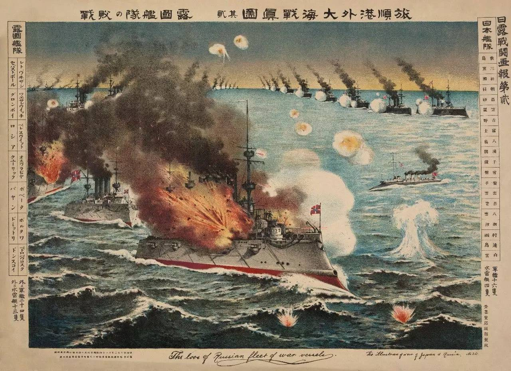

# DR-WIKI
 >大日本帝国 （游戏开局） 
 ### 日本近代政治转型的危机与重构（1905-1919）：从日俄战争到大正民主

1905年至1919年是日本近代政治史的关键转折期。在短短15年间，日本经历了从军事扩张受挫、财政危机爆发到宪政体制重构的剧烈震荡。这一过程深刻暴露了明治宪法体制的内在矛盾，也展现出日本在现代化进程中如何通过内外压力推动政治改革。

#### 一、日俄战争后的系统性危机（1905-1908） 

1905年日俄战争虽以日本惨败告终，但其经济代价远超预期。战争消耗占当时日本GDP的85%，迫使政府发行高达14.6亿日元的战时国债，其中60%依赖英美资本市场。这种"透支型扩张"模式在1907年全球经济危机中遭遇重创：伦敦金融市场利率飙升导致日本国债信用评级从A级骤降至BB级，外债偿还危机直接引发国内金融恐慌，东京股票交易所单日跌幅达23%，史称"明治四十年恐慌"。

面对财政破产风险，桂太郎内阁在1908年与英国签署《兰开斯坦备忘录》，以开放满洲铁路权益和降低纺织品关税为代价，换取2.5亿英镑债务展期。这种"卖权偿债"行为引发国内强烈反弹：关西财阀指责政府牺牲工商业利益，立宪政友会则在议会提出"国权贩卖弹劾案"。这标志着明治维新以来"富国强兵"路线的根本性动摇，国家主义与资本利益的矛盾首次公开化。

#### 二、明治宪法的双重失能与护宪运动（1910-1912）

1910年"第二次宪法失能事件"暴露出明治体制的结构性缺陷。当议会因预算案争执陷入僵局时，明治宪法第67条"既定经费"条款成为死结：政府要求延续上年度军事预算，而民党议员坚持削减海军造舰费。这种"预算战争"导致国家机器停摆128天，最终迫使山县有朋以元老身份出面组阁，开创"超宪法内阁"先例。此时宪法第55条"国务大臣辅弼责任"与第37条"议会协赞权"形成制度性对抗，"官民一致"原则彻底破产。

1912年爆发的第一次护宪运动标志着市民政治觉醒。东京法学博士团体发表《宪政危殆宣言》，指出："当宪法条文不能自行运转，而需元老政治强启时，帝国宪政已名存实亡"。运动迅速席卷全国，大阪商工会议所发起"反阀族同盟"，神户港码头工人则以"宪政死守"名义罢工。在舆论压力下，山县内阁倒台，持续26年的萨长藩阀体制就此终结。这场运动不仅推翻传统门阀政治，更催生"宪政常道"理念，为政党政治奠定基础。

#### 三、自由主义浪潮与体制重构（1915-1919）

1915年第三次大同团结运动将政治变革推向新阶段。自由党领袖犬养毅提出"主権在民、普選実現"纲领，组织10万人包围帝国议会。与以往运动不同，此次抗争得到新兴中产阶级支持：东京帝国大学法学部教授团体集体辞职声援，三井物产职员成立"白领同盟"进行政策游说。虽然起义遭军警镇压，但迫使政府颁布《选举法修正案》，将选民财产资格从10日元降至3日元，选民人数从150万增至285万。

至1919年议会重组时，日本政治生态已发生质变。大偎重信内阁的成立标志着"政党内阁制"正式确立：19名阁僚中14人具有政党背景，陆军大臣首次由文官兼任。更深远的是美浓部达吉"天皇机关说"成为宪法解释主流，其"国家法人说"理论将天皇定位为"国家机关之首"，从根本上消解了"天皇主权论"的意识形态基础。这些变革与普选权扩大、工会合法化共同构成"大正民主"三大支柱。 

#### 四、转型期的历史逻辑与制度遗产
军事冒险引发的财政危机暴露了国家资本主义的脆弱性，迫使统治集团向市民社会让渡权力；其次，明治宪法的制度缺陷在危机中转化为改革动力，护宪运动成功将"宪政正常化"塑造为全民共识；加速了民主化进程。

但这场转型也埋下深层隐患：军部通过"统帅权独立"保持特殊地位，贵族院与枢密院仍具制衡力量，农村选举权尚未完全开放。从长远看，大正民主既是日本近代化进程的高峰，也预示了民主实验的脆弱性。

日本在1905-1919年间的经验表明：当传统体制无法应对内外挑战时，市民社会的政治觉醒与制度创新可能成为突破困局的关键力量。但这种转型的彻底性，又深刻受制于既得利益结构与历史传统的韧性。